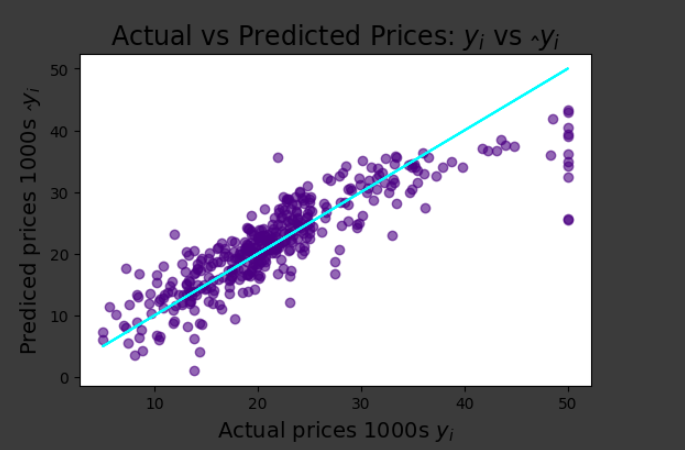
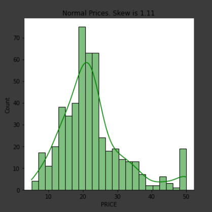
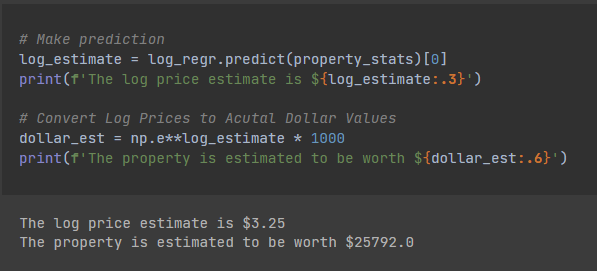

# DataAnalys_MutiVariableRegModel
Analysis and exploration the Boston house price data.

## Table of contents
* [General info](#general-info)
* [Screenshots](#screenshots)
* [Technologies](#technologies)
* [Setup](#setup)
* [Status](#status)

## General info
It is one of the Data Analysing projects which is suppoused to hone my skills in that category.

Main goals of the project were:
* How to spot relationships in a dataset using Seaborn's .pairplot()
* How to split data into a training and testing dataset to better evaluate a model's performance.
* How to run a multivariable regression.
* How to evaluate the regression model using (a log) data transformation.
* How to use model to make a prediction.

As a notebook I used Datalore from Jetbrains.

It's one of the projects from [Angela's Python Bootcamp](https://www.udemy.com/course/100-days-of-code/)

## Screenshots

## Technologies
* Python 3.8
* Pandas 1.3.3
* Matplotlib 3.4.3
* Seaborn 0.11.2

## Setup
Import notebook and data from csv file into one of the Data Science Notebooks (f.e. Datalore).

## Status
Project is: _finished_.
